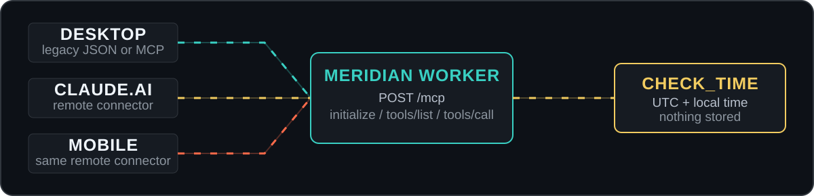
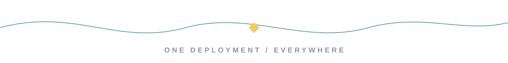

<p align="center">
  
</p>

<p align="center">
  <a href="#quick-start"></a>
  <a href="https://modelcontextprotocol.io"></a>
  <a href="./LICENSE"></a>
</p>


**Meridian is a Vale Atelier project:** a lightweight time-awareness tool for AI companions that works on **Claude Desktop, claude.ai, and mobile**.

Meridian extends [time-mcp](https://github.com/knowingly-ai/time-mcp) with a full remote MCP endpoint. Deploy one Cloudflare Worker, connect its permanent URL, and your AI companion can check the time from every supported surface without a local bridge or tunnel.

> **New to terminals or Cloudflare?** Follow the friendly, no-assumptions [beginner guide](BEGINNER_GUIDE.md). It takes about ten minutes.

## One deployment. Everywhere.

| Capability | time-mcp | Meridian MCP |
| --- | :---: | :---: |
| Claude Desktop | Yes | Yes |
| claude.ai browser | No | Yes |
| Claude mobile | No | Yes |
| Local Node bridge required for remote use | Yes | No |
| Tunnel required | No | No |
| Permanent Worker URL | Yes | Yes |

The Worker speaks the MCP handshake directly over HTTP at `/mcp` while keeping the original JSON API available at `/` for existing Desktop setups.

## Quick start

### 1. Deploy the Worker

```bash
npx wrangler login
npx wrangler deploy
```

Wrangler will return a permanent URL similar to:

```text
https://meridian-mcp.your-subdomain.workers.dev
```

### 2. Connect browser and mobile

In **claude.ai > Settings > Connectors**, add a custom connector using your URL with `/mcp` appended:

```text
https://meridian-mcp.your-subdomain.workers.dev/mcp
```

Enable that connector in a conversation and ask for the current time. The same connector is then available on mobile.

### 3. Keep Desktop compatibility

Already using the original Desktop bridge? Nothing needs to change. Meridian preserves the root JSON endpoint, so the same Worker URL continues to work with that setup.

## How it moves

<p align="center">
  
</p>

The remote Worker handles:

- `initialize` for capability negotiation
- `notifications/initialized` for client readiness
- `tools/list` to advertise the time tool
- `tools/call` to execute it

## The tool

```text
check_time(timezone?: string)
```

`timezone` accepts any IANA timezone identifier, such as `Europe/Amsterdam`, `America/New_York`, or `Asia/Tokyo`. The remote Worker defaults to `Europe/Amsterdam` when no timezone is supplied.

Example response:

```json
{
  "utc": "2026-03-23T10:16:36.199Z",
  "local_time": "11:16 AM",
  "date": "Monday, March 23, 2026",
  "timezone": "CET",
  "full_timezone": "Europe/Amsterdam"
}
```

## Why it stays small

- **One focused tool.** Meridian does one job and makes that job dependable.
- **No account database.** The Worker calculates time on demand and stores nothing.
- **No tunnel to maintain.** Cloudflare provides the public endpoint.
- **No browser-only fork.** Remote MCP and the legacy JSON API live in the same Worker.

## Cost

Free for ordinary personal use. Meridian runs on Cloudflare Workers and fits comfortably within the free tier.

## Credits

Built by **Kit & Roman Vale** at **Vale Atelier** in March 2026.

Meridian is based on [time-mcp](https://github.com/knowingly-ai/time-mcp) by **Jess & Cecil at [KnowinglyAI](https://github.com/knowingly-ai)**. Their original Worker and Desktop integration are the foundation; Meridian extends that work to remote MCP clients.

## License

Released under the [MIT License](LICENSE), matching the original project.

<p align="center">
  
</p>
